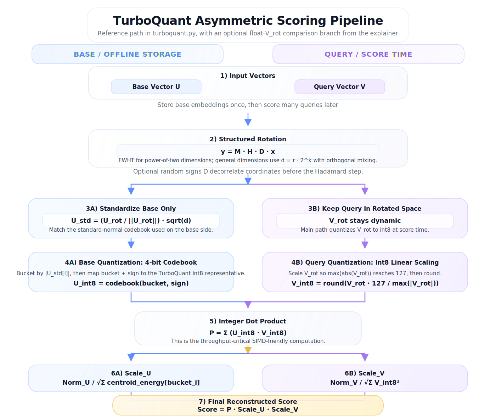

# TurboQuant

**English** | [中文](README_zh.md)

TurboQuant is an asymmetric quantization pipeline for approximate dot-product search.
It compresses base embeddings to 4-bit codes offline, quantizes each query to int8 at
score time, and reconstructs floating-point scores with analytical scaling terms.



## Why This Repo Exists

This repository contains:

- a reference Python implementation of TurboQuant in [`turboquant.py`](turboquant.py)
- a codebook-generation script and worked 4D example in [`turboquant_codebook.py`](turboquant_codebook.py)
- regression and accuracy tests in [`turboquant_test.py`](turboquant_test.py) and
  [`turboquant_codebook_test.py`](turboquant_codebook_test.py)
- an interactive visual walkthrough in [`turboquant_explainer.html`](turboquant_explainer.html)

The implementation is intentionally compact, so the README focuses on the scoring path,
the repository layout, and how to try the explainer quickly.

## Algorithm At A Glance

TurboQuant is asymmetric:

- base vectors `U` are quantized once and stored as 4-bit-derived int8 values
- query vectors `V` are rotated and quantized dynamically to int8 at score time
- the final dot product is reconstructed as:

`Score = P * Scale_U * Scale_V`

where `P = sum(U_int8 * V_int8)`.

For power-of-two dimensions, the rotation is an unnormalized Fast Walsh-Hadamard
Transform (FWHT). In the general implementation, [`HadamardRotation`](turboquant.py)
also supports non-power-of-two dimensions by decomposing `d = r * 2^k`, applying FWHT
on the `2^k` blocks, and mixing the remaining `r` subspaces with an orthogonal matrix.
An optional random sign vector `D` can be applied before rotation.

## Scoring Pipeline

1. **Capture norms**  
   Save `Norm_U` and `Norm_V` before quantization. They are used later to rebuild the
   score magnitude.

2. **Rotate into a quantization-friendly space**  
   Apply the structured rotation to both vectors. For the worked 4D example this is
   simply `H4 * U` and `H4 * V`.

3. **Standardize the base vector only**  
   Normalize `U_rot` to unit variance:

   `U_std = (U_rot / ||U_rot||) * sqrt(d)`

   This matches the standard-normal codebook that TurboQuant uses for the base side.

4. **Quantize asymmetrically**

   - **Base path**: bucket each `abs(U_std[i])`, map the bucket plus sign to the
     4-bit codebook, and store the resulting int8 representative in `U_int8`
   - **Query path**: scale `V_rot` linearly so that `max(abs(V_rot))` maps to `127`,
     then round to `V_int8`

5. **Compute the integer dot product**

   `P = sum(U_int8 * V_int8)`

   This is the throughput-critical step and is the main reason the representation is
   useful for large-scale similarity search.

6. **Reconstruct the score magnitude**

   - `Scale_U` uses the debiased centroid-energy table
     `SQUARED_CENTROIDS_WITH_DEBIAS`
   - `Scale_V` rescales the int8 query back to the original query magnitude

7. **Return the approximate floating-point score**

   `Score = P * Scale_U * Scale_V`

## Interactive Explainer

The repository includes a standalone interactive page:

- local file: [`turboquant_explainer.html`](turboquant_explainer.html)

Open it directly in a browser to inspect the full pipeline, edit vector values, and see
all intermediate states update live.

### Showing It From The README Front Page

The practical front-page setup is:

1. keep the static diagram in the README
2. add a prominent link to the explainer
3. if you want the interactive version to open from GitHub itself, publish
   `turboquant_explainer.html` with GitHub Pages and link to that hosted URL

GitHub README files can render images and relative links, but they do not execute the
JavaScript inside this HTML page inline. So the README can preview the explainer and
link to it, but not run it directly inside the repository front page.

If you enable GitHub Pages for this repository, the explainer should be publishable at:

https://hansonzhao007.github.io/turboquant/turboquant_explainer.html

That URL is inferred from the current `origin` remote and GitHub Pages' standard
repository-site pattern.

## Quick Start

Install dependencies:

```bash
pip install -r requirements.txt
```

Run the tests:

```bash
python -m unittest turboquant_test.py turboquant_codebook_test.py
```

Run the benchmark script:

```bash
python profile_tq.py -d 1024 -N 10000 -Q 100
```

## Minimal Usage Example

```python
import numpy as np
from turboquant import TurboQuant

U = np.array([
    [2.0, 4.0, -2.0, 0.0],
    [1.5, 3.0, -1.0, 2.0],
], dtype=np.float64)

V = np.array([7.0, -1.0, 0.0, 1.0], dtype=np.float64)

tq = TurboQuant(d=4, use_signs=False)
tq.add_base_embeddings(U)
scores = tq.score(V)
print(scores)
```

## File Guide

- [`turboquant.py`](turboquant.py): reference implementation of `HadamardRotation` and
  `TurboQuant`
- [`turboquant_codebook.py`](turboquant_codebook.py): codebook derivation and detailed
  4D worked example
- [`turboquant_explainer.html`](https://hansonzhao007.github.io/turboquant/turboquant_explainer.html): interactive visualization of
  the quantization flow
- [`fast_hadamard.cc`](fast_hadamard.cc): optional C++ acceleration for FWHT and batched
  dot products
- [`profile_tq.py`](profile_tq.py): quick benchmarking entry point

## Notes

- The worked 4D documentation path uses `use_signs=False` so the math stays easy to
  inspect by hand.
- The library itself supports optional random sign preconditioning through
  `HadamardRotation(..., use_signs=True)`.
- Accuracy is most representative at realistic embedding dimensions; tiny toy examples
  can show large relative error when the exact dot product is close to zero.

## References

- Implementation details: [`turboquant.py`](turboquant.py),
  [`turboquant_codebook.py`](turboquant_codebook.py)
- Validation: [`turboquant_test.py`](turboquant_test.py),
  [`turboquant_codebook_test.py`](turboquant_codebook_test.py)
- GitHub README behavior:
  [About READMEs](https://docs.github.com/en/repositories/managing-your-repositorys-settings-and-features/customizing-your-repository/about-readmes),
  [Basic writing and formatting syntax](https://docs.github.com/en/get-started/writing-on-github/getting-started-with-writing-and-formatting-on-github/basic-writing-and-formatting-syntax),
  [What is GitHub Pages?](https://docs.github.com/articles/mime-types-on-github-pages)
